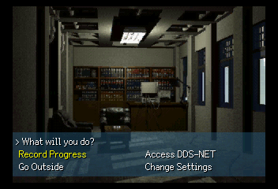
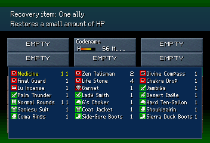
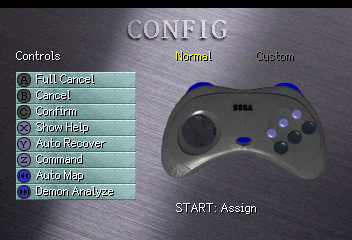
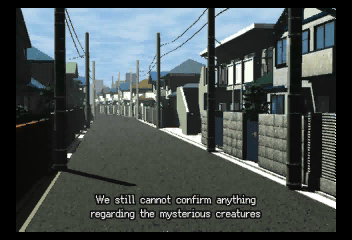

# Devil Summoner Saturn Translation Tools

**This is not a finished translation or patch. It is not yet intended for release.**

This repo provides various translation tools for modifying a .bin/.cue dump of Shin Megami Tensei: Devil Summoner (Rev. B), with the intent of facilitating easy translation of the game into English, and potentially other languages.

## AI Disclosure

The source code in this repository was developed with the assistance of AI tools. While the author believes that current AI products are inflicting tremendous social, economic, and environmental harms, they also believe that, when used and deployed responsibly, the underlying technology has genuine potential and value.

If you're dissatisfied with this, the author encourages you to fork or otherwise create your own tools, translation, and/or documentation. The goal of an open-source project like this is to provide a high-quality translation for a game that has gone without one for over 30 years (and to leave behind resources the community can freely use to modify, or expand that translation into even more languages).

And if you believe that a technology like AI is fundamentally theft, no matter how it is deployed, [I have some recommended reading.](https://archive.org/details/in.ernet.dli.2015.124455)

## Remaining Work

* **The entire EN translation is provisional MTL and un-reviewed**
* In-game textures still need to be translated
* Substantial amounts of the game are untested
* Miscellaneous polish; text alignment, adding hooks for already-EN text consumers
* Further support in the font package to better facilitate defining and rendering other languages' glyphs

## Getting Started

### 1. Set up the virtual environment

```powershell
python -m venv .venv
.\.venv\Scripts\python.exe -m pip install --upgrade pip
.\.venv\Scripts\python.exe -m pip install -r requirements.txt
```

### 2. Add and extract the original disc

Copy the Rev. B dump of the original game to the `rom/original/` directory.

```text
rom/original/
|-- PLACE_ROM_HERE.txt
|-- Shin Megami Tensei - Devil Summoner (Japan) (Rev B).cue
|-- Shin Megami Tensei - Devil Summoner (Japan) (Rev B) (Track 1).bin
`-- Shin Megami Tensei - Devil Summoner (Japan) (Rev B) (Track 2).bin
```

Extract the disc files and generate the font repack metadata using the following commands.

```powershell
.\.venv\Scripts\python.exe -B -m disc.script.extract
.\.venv\Scripts\python.exe -B -m font.script.repack
```

### 3. Preview and edit the text corpus

Use the browser-based preview window to verify line-wrapping widths, edit the active translation, and record review status.
Preserve brace-enclosed control codes from the source Japanese text.

```powershell
.\.venv\Scripts\python.exe -B -m text.editor
```

### 4. Build a patched image

Run the following to build the patched image. Blank `tr` fields fall back to Japanese.

```powershell
.\.venv\Scripts\python.exe -B build
```

Use `--plan` to inspect the stages or `--check` to verify the existing outputs without rewriting them.

The output will be written to:

```text
rom/build/disc/Shin Megami Tensei - Devil Summoner (Japan) (Rev B).cue
```

## Asset Patching

### Textures

Textures with translatable text are stored in `visual/translation_images/original/` and `visual/translation_images/translated/`.
The former directory is purely for reference; modified images should be placed in the latter directory, without modifying format or dimensions.

The following commands outline a full extract-repack workflow for game textures:

```powershell
.\.venv\Scripts\python.exe -B -m visual.script.extract
.\.venv\Scripts\python.exe -B -m visual.script.validate
.\.venv\Scripts\python.exe -B -m visual.script.repack
.\.venv\Scripts\python.exe -B -m visual.script.repack --check
```

As the relevant textures for translation are already tracked, you will likely only need `repack`.
Only modified files will be replaced during a repack.

### FMVs

Movie editing requires `ffmpeg` and `ffprobe` on `PATH`.

The following commands outline a full extract-repack workflow for game FMVs:

```powershell
.\.venv\Scripts\python.exe -B -m fmv.script.catalog --check
.\.venv\Scripts\python.exe -B -m fmv.script.extract
.\.venv\Scripts\python.exe -B -m fmv.script.repack
.\.venv\Scripts\python.exe -B -m fmv.script.repack --check
```

As the relevant subtitles for translation are already tracked, you will likely only need `repack` (unless you'd like to attempt translating things like battle/skill FMVs).

## Building a release patch

Install the Windows x86-64 build of
[xdelta3 3.2.0](https://github.com/jmacd/xdelta/releases/tag/v3.2.0), then run:

```powershell
.\.venv\Scripts\python.exe -B build --release --plan --xdelta "C:\Tools\xdelta3\xdelta3.exe"
.\.venv\Scripts\python.exe -B build --release --xdelta "C:\Tools\xdelta3\xdelta3.exe"
.\.venv\Scripts\python.exe -B build --release --check --xdelta "C:\Tools\xdelta3\xdelta3.exe"
```

See the [disc documentation](docs/disc.md#xdelta-artifact) for release artifacts
and patch application.

## Documentation

- [Text](docs/text.md): corpus formats, tokens, layout, and repacking.
- [Font](docs/font.md): font atlases, mappings, and generated metrics.
- [Visual](docs/visual.md): still-image extraction and repacking.
- [FMV](docs/fmv.md): movie extraction, subtitles, and Saturn constraints.
- [Engine](docs/engine.md): runtime patches and generated contracts.
- [Disc](docs/disc.md): source validation, assembly, and xdelta.

## License

All project-authored source code and documentation are licensed under the [BSD Zero Clause License](LICENSE). You can do whatever you want with these materials.

Some of the repository does not fall under this clause, however. Such files include:

- every JSON file under `text/corpus/`;
- every PNG under `visual/translation_images/`;
- the FMV subtitle file, `fmv/subtitles/BGDATA/START2.ass`;
- preview screenshots of the patch, under `docs/`; and
- the bundled font files under `font/source/ark-pixel-font/` and `font/source/galmuri7/`.

The original game script, translatable textures, FMV subtitles, and preview screenshots are protected by ATLUS's copyright, and included in this repo on the basis of fair use. They must not be redistributed for profit.

The fonts remain subject to their respective third-party license conditions.
See [LICENSE](LICENSE) for the complete scope.

## Preview/Example Screenshots

|                      **Title**                      |             **Fusion Table**             |
| :-------------------------------------------------------: | :---------------------------------------------: |
|                  |      |
|                **Equipment Screen**                |             **Event Choice**             |
|        |  |
|                 **3D Field Event**                 |               **Inventory**               |
|          |      |
|               **Negotiation Choice**               |                 **Shop**                 |
|  |          |
|                    **Settings**                    |                **Status**                |
|            |      |
|                  **FMV Subtitles**                  |              **Name Input**              |
|                      |          |
